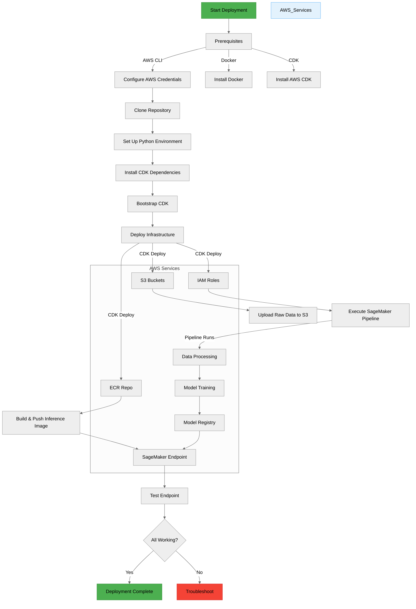
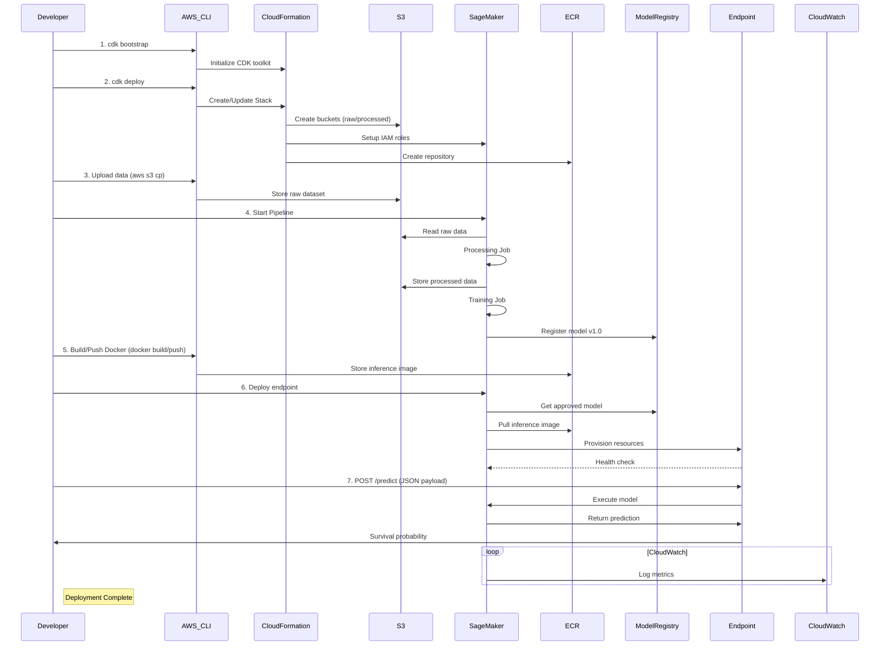

### Basic Documentation
###
## 🛠️ Technical Stack
- **Infrastructure**: AWS CDK (Python)
- **ML Pipeline**: SageMaker Pipelines with Processing/Training steps
- **Serving**: SageMaker Endpoint (managed) or Custom Container (FastAPI)

## ✅ Prerequisites
- AWS Account with necessary permissions
- AWS CLI configured
- Docker (for custom inference image)


## 📁 Project Structure
```plaintext
titanic-ml-pipeline/
├── cdk/
│   ├── app.py
│   ├── titanic_stack.py
│   └── requirements.txt
├── processing_scripts/
│   ├── preprocess.py
│   └── requirements.txt
├── training_scripts/
│   ├── train.py
│   └── requirements.txt
├── inference/
│   ├── app.py (FastAPI)
│   ├── lambda_handler.py
│   ├── Dockerfile
│   └── requirements.txt
├── notebooks/
│   └── data_exploration.ipynb
├── pipelines/
│   ├── titanic_pipeline.py
│   └── trigger_pipeline.py
└── README.md
```

next you can find the process to deploy this project to production:


## 📁 Flowchart process



## 📁 Sequence of operations to do for use this solution



=======
´´´
>>>>>>> Stashed changes
