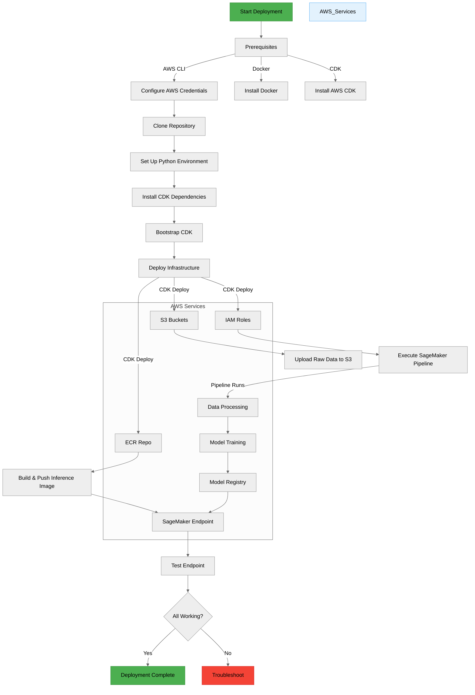

### Basic Documentation
###
This is the structure of this project
```plaintext
titanic-ml-pipeline/
├── cdk/
│   ├── app.py
│   ├── titanic_stack.py
│   └── requirements.txt
├── processing_scripts/
│   ├── preprocess.py
│   └── requirements.txt
├── training_scripts/
│   ├── train.py
│   └── requirements.txt
├── inference/
│   ├── app.py (FastAPI)
│   ├── lambda_handler.py
│   ├── Dockerfile
│   └── requirements.txt
├── notebooks/
│   └── data_exploration.ipynb
├── pipelines/
│   ├── titanic_pipeline.py
│   └── trigger_pipeline.py
└── README.md
```

next you can find the process to deploy this project to production:

